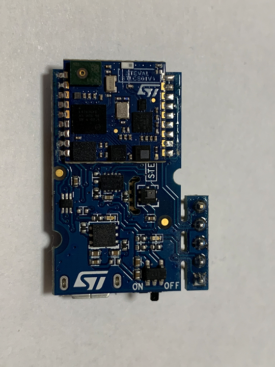
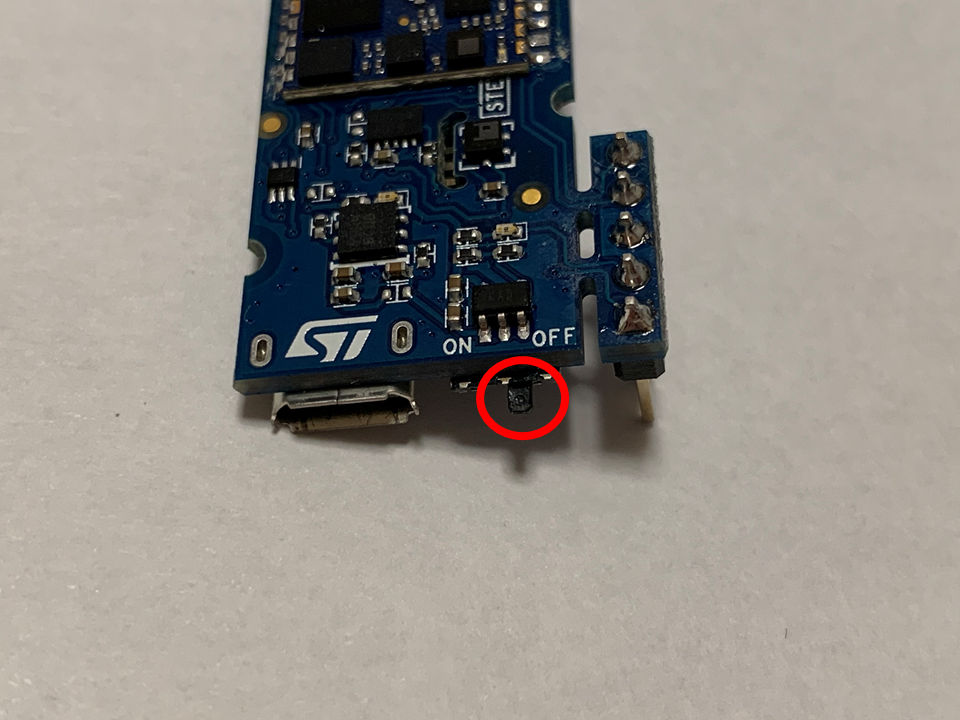
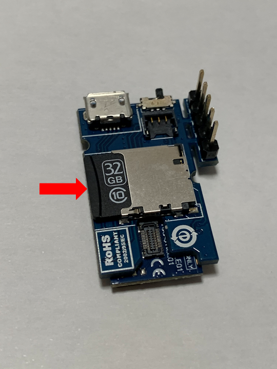
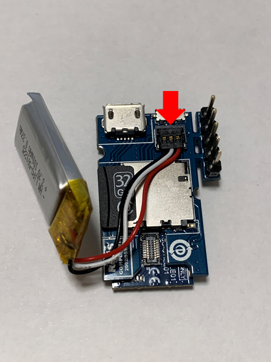
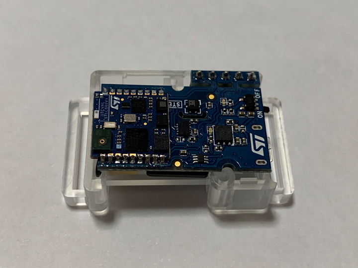
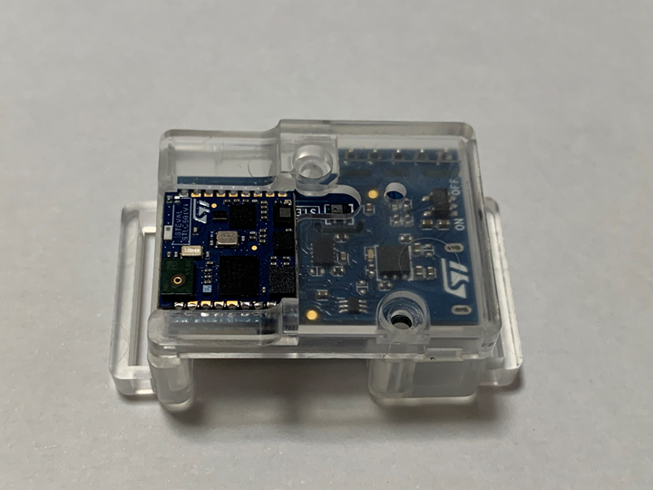
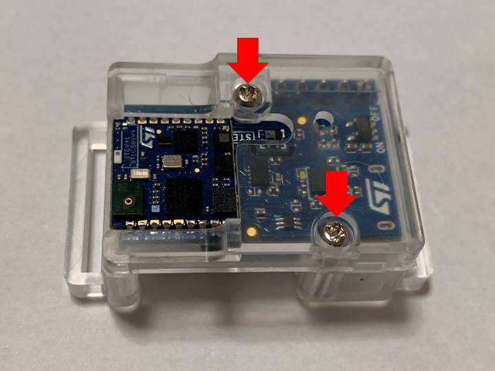
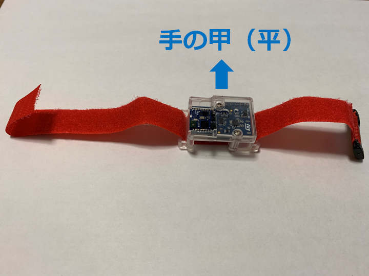
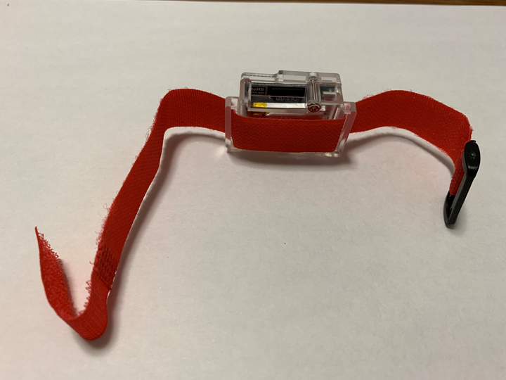

# 1-1.STM SensorTileを組み立てる
## 1-1-1. SensorTile基板の確認
### センサーモジュールのはんだづけ状態を確認
センサーモジュールのはんだづけがちゃんとできているかを確認します。  
* 基板とモジュールのピンがはんだで繋がっているか？
* 隣のピンとブリッジしていないか？  

### 電源SWの状態の確認
SensorTile基板の電源SWがOFFになっていることを確認します。  
**ON**になっている場合は、**OFF**にします。  
このSWは、**折れやすい**ので、壊さないように注意してOFFにします。  

## 1-1-2. microSDカードの挿入
写真の向きで、矢印のように挿入します。  

## 1-1-3. バッテリーの装着
バッテリーのコネクタを写真のように位置を合わせて、上から押し込みます。  

## 1-1-4. 基板のケースへの組込み
写真のように、基板をケースに入れて、ビスで締めます。  

## 1-1-5. バンドの取り付け
写真のように、バンドを取り付けます。  
取り付ける際に、左右のどちらの腕につけるかにより、バンドを締めやすい向きに合わせて取り付けます。  

* [目次ページへ戻る](../readme.md)
