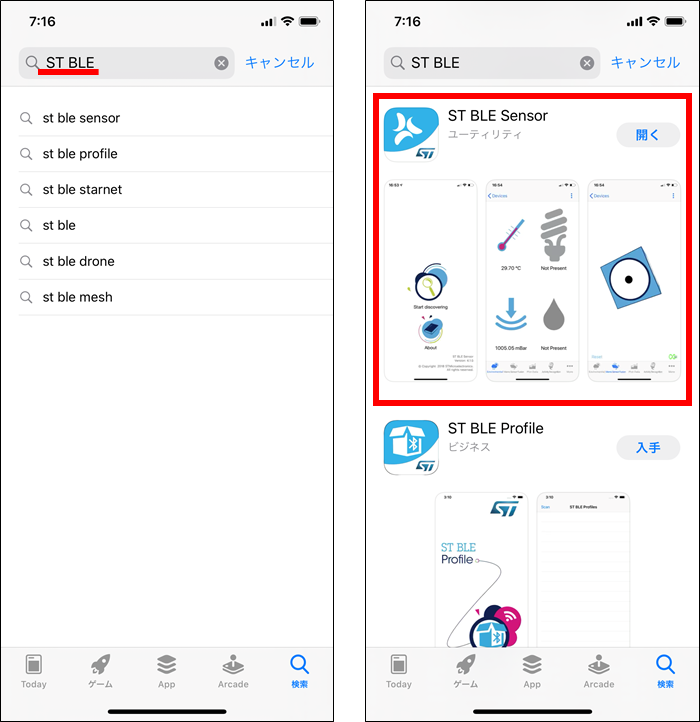
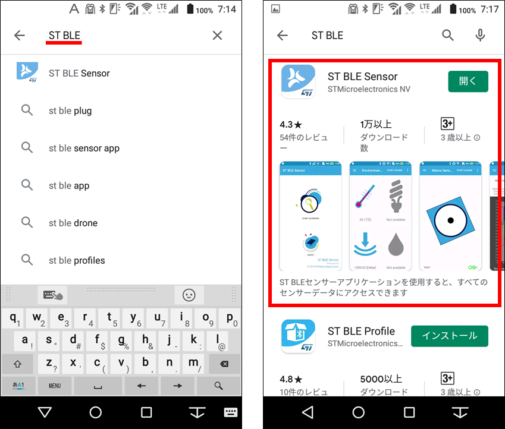
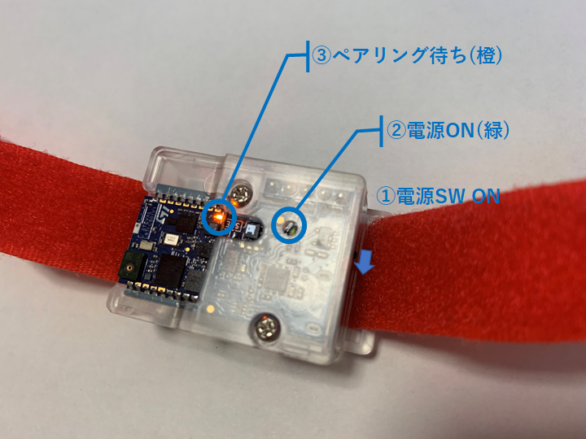
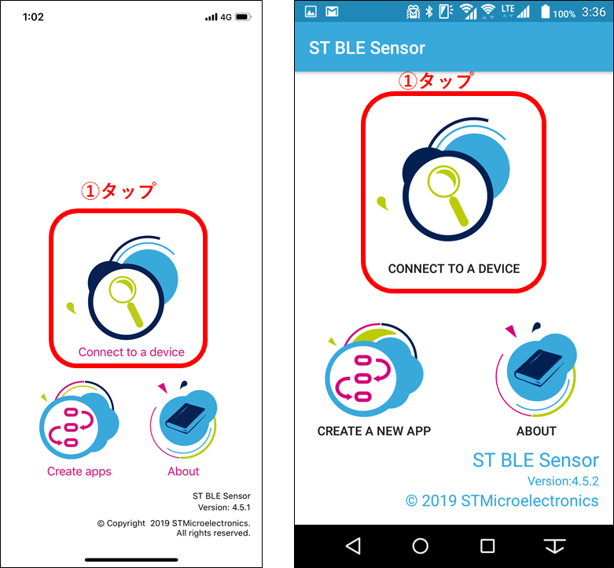
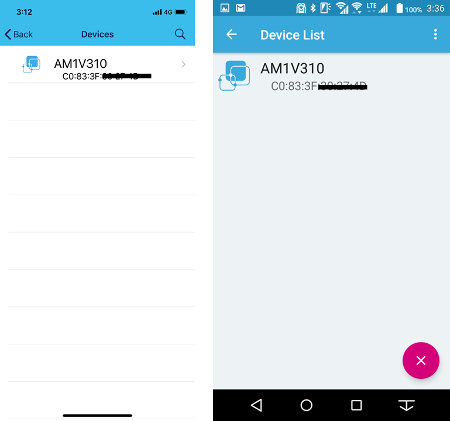
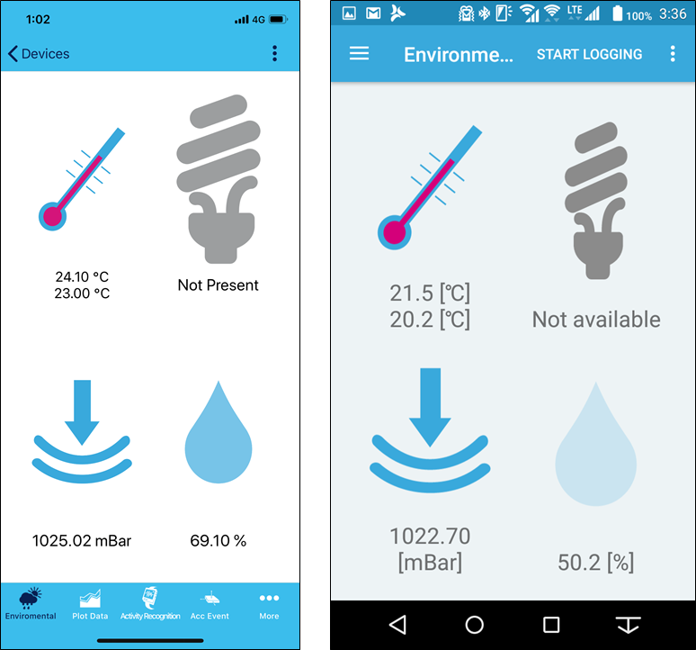

# 1-2.スマホアプリを接続する
## 1-2-1. スマホ(iPhone, iPad / Android)にST BLE Sensorアプリをインストールする
* iPhone, iPadの場合
  * Apple App Storeから「ST BLE Sensor」アプリを検索し、インストールします。  

* Androidの場合
  * Google Playストアから「ST BLE Sensor」アプリを検索し、インストールします。  

## 1-2-2. SensorTileの電源をONにしてST BLE Sensorアプリとペアリングする
* ①電源SWをONにします。  
* ②電源インジケータが緑に光ります。  
* ③ペアリング待ちの橙LEDが点滅します。  

スマホアプリを起動し、「Connect to a device」のアイコンをタップします。  
(左がiPhoneアプリ、右がAndroidアプリです。)  

以下のようなペアリング待ちのデバイス一覧が表示されます。
* ハンズオン中は、同じ名前のデバイスが表示され、自分のデバイスが見つけにくい状態になります。  
  周りで同じデバイスを電源ONにしている人がいない場所でペアリングすることをおすすめします。  
(左がiPhoneアプリ、右がAndroidアプリです。)  

正常にペアリングが完了すると、以下のような表示に切り替わり、いくつかのセンサのデータ表示がされます。  
(左がiPhoneアプリ、右がAndroidアプリです。)  

* [目次ページへ戻る](../readme.md)
